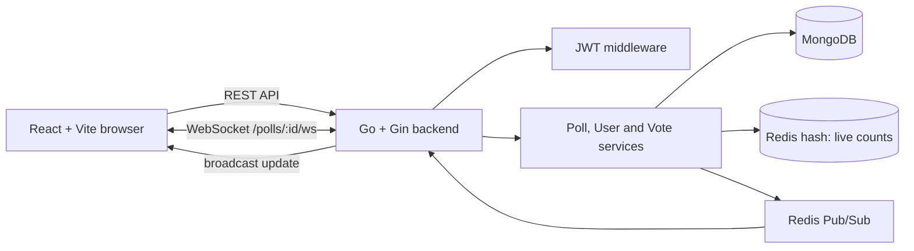

# Live Polling

> Create a poll, share one link, and watch the results move in real time.

Live Polling is a full-stack real-time voting application. A user can register, create a poll with multiple options, share the poll URL, and see vote counts update instantly for every connected participant.

[](frontend/)
[](backend/)
[](https://www.mongodb.com/)
[](https://redis.io/)

## Why This Project?

Most polling apps refresh results manually. Live Polling keeps everyone on the same page: when someone votes, the updated count is published through Redis and delivered to all viewers over WebSocket without refreshing the browser.

## Features

- Register and log in with email and password
- JWT-based protected actions
- Create polls with two or more options
- Share a poll using its URL
- Vote without refreshing the page
- See live vote counts and total votes
- Close a poll securely as its creator
- Responsive React interface with clear poll states
- Redis-backed result updates through WebSocket
- Layered Go backend with handlers, services, repositories, and middleware

## Tech Stack

| Layer | Technology |
| --- | --- |
| Frontend | React 19, Vite, JavaScript, CSS |
| Backend | Go 1.27+, Gin |
| Primary database | MongoDB |
| Fast counters and messaging | Redis, Redis Pub/Sub |
| Authentication | JWT with bcrypt password hashing |
| Realtime transport | WebSocket with Gorilla WebSocket |

## Architecture / Flow



### Vote flow

1. The participant selects an option in the React app.
2. The frontend sends `POST /polls/:id/vote` to the Go API.
3. The backend validates the poll and option, stores the vote in MongoDB, and increments the live count in Redis.
4. Redis publishes an update on the poll-specific channel `poll:<pollId>`.
5. The realtime service receives the event and broadcasts it to all WebSocket clients viewing that poll.
6. Every connected browser updates its result state immediately.

## Frontend and Backend Roles

**Frontend**

- Provides registration, login, poll creation, voting, results, and sharing UI.
- Stores the JWT in `localStorage` for the current browser session.
- Reads the poll ID from `/poll/:id`.
- Loads initial poll data and results through REST, then listens for live updates over WebSocket.

**Backend**

- Exposes REST APIs and the WebSocket endpoint.
- Validates poll input, votes, ownership, and poll status.
- Handles authentication and authorization with JWT middleware.
- Uses repositories for database access and services for business logic.
- Coordinates MongoDB persistence with Redis counters and Pub/Sub events.

## MongoDB and Redis

### MongoDB: source of truth

The backend uses the `live_polling` database with these collections:

- `users`: registered user records with hashed passwords
- `polls`: questions, options, creator, active status, and creation time
- `votes`: submitted votes and poll references

### Redis: speed and realtime delivery

- Stores live option totals in a hash such as `poll:<pollId>:results`.
- Returns current results quickly through `HGETALL`.
- Publishes each vote update to `poll:<pollId>`.
- Keeps realtime fan-out separate from the durable MongoDB records.

## Authentication

1. A user registers through `POST /auth/register`.
2. Passwords are hashed with bcrypt before they are stored.
3. Login returns a JWT valid for 24 hours.
4. Protected requests send `Authorization: Bearer <token>`.
5. The middleware validates the signature and extracts `userId` from the token.
6. Creating and closing polls require authentication. Only the poll creator can close their poll.

## Local Setup

### Prerequisites

- Go 1.27 or newer
- Node.js and npm
- MongoDB running on `localhost:27017`
- Redis running on `localhost:6379`

### 1. Start the backend

```bash
cd backend
go mod download
go run .
```

The API starts at `http://localhost:8080`.

### 2. Start the frontend

Open a second terminal:

```bash
cd frontend
npm install
npm run dev
```

The Vite app starts at `http://localhost:5173`.

Open the frontend, create an account, log in, create a poll, and share the generated `/poll/<poll-id>` URL with another browser tab to see realtime updates.

## Environment Variables

Both services have local fallbacks, so the default setup works without an `.env` file. For a real deployment, set these values explicitly.

### Backend

| Variable | Example | Purpose |
| --- | --- | --- |
| `MONGO_URI` | `mongodb://localhost:27017` | MongoDB connection string |
| `REDIS_URL` | `redis://localhost:6379` | Redis connection string |
| `JWT_SECRET` | `replace-with-a-long-random-secret` | JWT signing secret |
| `FRONTEND_URL` | `http://localhost:5173` | Additional allowed CORS origin |
| `PORT` | `8080` | Backend HTTP port |

### Frontend

Create `frontend/.env` when the API is not running on the default URL:

```env
VITE_API_URL=http://localhost:8080
```

The frontend derives the WebSocket URL from `VITE_API_URL` automatically.

## API Overview

Base URL: `http://localhost:8080`

| Method | Endpoint | Auth | Purpose |
| --- | --- | --- | --- |
| `GET` | `/` | No | Health message |
| `POST` | `/auth/register` | No | Create a user account |
| `POST` | `/auth/login` | No | Login and receive a JWT |
| `POST` | `/polls` | Yes | Create a poll |
| `GET` | `/polls/:id` | No | Get poll details |
| `GET` | `/polls/:id/results` | No | Get current Redis-backed results |
| `POST` | `/polls/:id/vote` | No | Submit a vote |
| `PUT` | `/polls/:id/close` | Yes, owner | Close a poll |
| `GET` | `/polls/:id/ws` | WebSocket | Receive live vote updates |

Example vote request:

```bash
curl -X POST http://localhost:8080/polls/<poll-id>/vote \
  -H "Content-Type: application/json" \
  -d '{"option":"React"}'
```


## Live Demo

A hosted demo is not configured yet. The project can be run locally using the setup steps above.

- Source code: [GitHub repository]  https://github.com/tanujkhandelwal007-bit/live-polling
- Local frontend: `http://localhost:5173`
- Local API: `http://localhost:8080`
- Live Deployed Link- https://live-polling007.onrender.com/

## Project Structure

```text
live-polling/
├── backend/
│   ├── config/          MongoDB and Redis connections
│   ├── handlers/        HTTP and WebSocket handlers
│   ├── middleware/      JWT authentication
│   ├── models/          Poll, user, and vote models
│   ├── repositories/    MongoDB data access
│   ├── routes/          API route registration
│   └── services/        Business logic and realtime services
└── frontend/
    └── src/             React application and styles
```

## What This Project Demonstrates

Live Polling is a compact example of building a production-shaped full-stack feature: secure authentication, clean backend layering, durable data storage, fast counters, event-driven updates, and a frontend that responds to realtime state changes.
